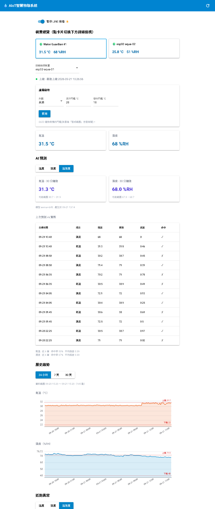
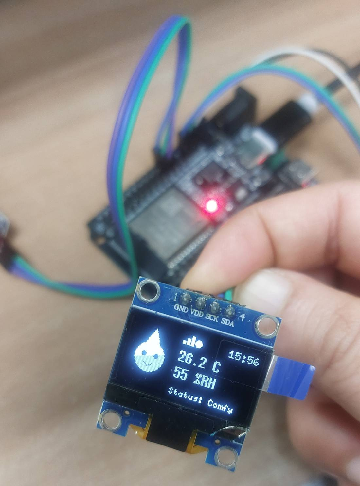
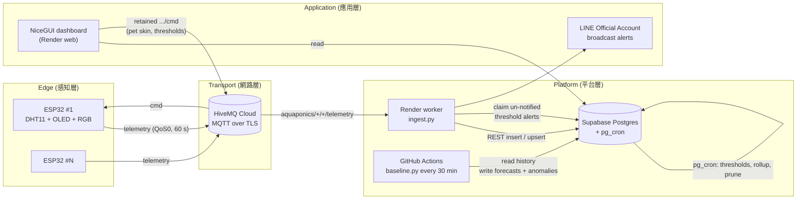

# AIoT智慧物聯系統 — Smart Aquaponics Edge Monitor & AI Predictor

An end-to-end IoT project: ESP32 edge nodes with a pixel-pet OLED UI stream
environment telemetry over MQTT/TLS to a cloud pipeline that stores the
time-series, forecasts the next 30 minutes, detects anomalies, shows everything
on a live dashboard and pushes LINE alerts when a reading leaves its safe band.

**Live dashboard:** https://aquaponics-dashboard-bja1.onrender.com
(NiceGUI on Render, always-on)



<!-- Add your own photos / demo here, e.g.

[Demo video](https://youtu.be/xxxxxxxx)
-->

**Phase 1 (this repo):** air temperature + humidity, OLED pet UI, RGB status
light, MQTT → Supabase, baseline ML, dashboard, LINE alerts, multi-board.
**Phase 2 (planned):** water temperature (DS18B20), pH (DFRobot SEN0161-V2),
soil moisture — the data model and feature pipeline already have slots for them.

## Architecture



MQTT topic contract (`aquaponics/<site>/<device>/…`):

| Topic | Direction | Notes |
|---|---|---|
| `telemetry` | device → cloud | QoS 0, JSON, one packet per minute |
| `status` | device → cloud | retained; LWT marks the device offline |
| `cmd` | cloud → device | retained; `{"pet","pet_hot","pet_cold"}` |

## Highlights

- **Non-blocking firmware** — sensor read, animation, LED breathing and MQTT
  each run on their own `millis()` cadence; there is no `delay()` in `loop()`.
- **No secrets in the firmware image** — Wi-Fi (with a backup SSID via
  WiFiMulti), MQTT credentials and the device ID are provisioned at runtime
  through a WiFiManager captive portal and stored in NVS. One firmware image
  serves every board.
- **Multi-board** — every board gets its own `device_id`; the dashboard has a
  per-device overview and the AI job processes every registered device.
- **Wide table + `extra jsonb`** — new sensors can be added by the firmware
  without a schema migration.
- **Server-side alerting** — `pg_cron` checks thresholds every minute and
  writes at most one anomaly per device/metric/hour; the worker claims
  un-notified rows with a single atomic `UPDATE … WHERE notified_at IS NULL`
  so overlapping instances can never push the same alert twice.
- **LINE push** (Messaging API, since LINE Notify was discontinued) with a
  kill switch on the dashboard.
- **AI baseline** — EWMA + drift 30-min forecast with a predicted-vs-actual
  hit-rate/MAE panel; gated rolling z-score and multivariate IsolationForest
  for anomalies.
- **Remote control** — pet skin and the pet's hot/cold expression thresholds
  are set from the dashboard via retained MQTT `cmd`.

## Status — live (updated 2026-09-21)

Full pipeline deployed and running 24/7 across two boards.

- **Dashboard sections:** 裝置總覽 (multi-board summary), live values (red when
  out of band), AI 預測, history charts (10-min bins, dashed 上限/下限 lines),
  近期異常 (defaults to today, date + metric filters), editable alert thresholds.
- **Supabase `pg_cron`:** hourly rollup, 30-day raw retention, per-minute
  threshold alerting.
- **AI:** `.github/workflows/forecast.yml` runs `analysis/baseline.py` every
  30 min for every device → `aqua_forecasts` / `aqua_anomalies`.

## Stack

| Layer | Tech |
|---|---|
| Edge | ESP32-WROOM-32, PlatformIO + Arduino (C++), U8g2, non-blocking `millis()` FSM |
| Transport | MQTT over TLS — HiveMQ Cloud (Serverless free) |
| Ingest | Python `paho-mqtt` worker on Render |
| Storage | Supabase (PostgreSQL) — wide table + `extra jsonb`, `pg_cron` |
| AI | pandas + scikit-learn: EWMA+drift forecast, rolling z-score → IsolationForest |
| Dashboard | NiceGUI + ECharts on Render |
| Alerts | LINE Messaging API |
| Scheduling | GitHub Actions (forecast job) |

See [`docs/architecture.md`](docs/architecture.md) for the full design, wiring
tables, JSON schema, decisions log and deployment runbook.

## Hardware & wiring

| Part | Pin |
|---|---|
| DHT11 data | GPIO 4 |
| SSD1306 OLED (I²C) | SDA GPIO 21, SCL GPIO 22 |
| RGB LED (220 Ω each, LEDC PWM) | R GPIO 16, G GPIO 17, B GPIO 18 |
| BOOT button | GPIO 0 — hold 3 s after power-on to open the Wi-Fi portal |

## Repo layout

```
platformio.ini             PlatformIO project + pinned libs
include/secrets.h.example  copy -> include/secrets.h (gitignored)
src/main.cpp               firmware: sensor + pet animation + Wi-Fi/MQTT FSM
sql/                       Supabase DDL + migrations (run in order in the SQL editor)
worker/ingest.py           Render background worker: MQTT -> Supabase + LINE push
dashboard/app.py           NiceGUI dashboard (Render web service)
analysis/baseline.py       pull history -> forecast + anomalies -> write back
render.yaml                Render Blueprint (worker + dashboard)
.github/workflows/         scheduled forecast job
tools/png_to_xbm.py        convert a 48x48 1-bit PNG to a C XBM array (optional)
docs/architecture.md       design doc + decisions log
```

## Quick start

### 1. Firmware
```bash
cp include/secrets.h.example include/secrets.h   # fill in defaults
pio run -t upload && pio device monitor
```
Expected: OLED shows the pet + live T/H, RGB breathes green, serial prints
`[MQTT] publish OK ... /telemetry` every 60 s. On first boot (or hold BOOT for
3 s after reset) join the `AquaGuardian-Setup` Wi-Fi to enter Wi-Fi, MQTT and
device ID.

### 2. Database
Supabase SQL editor → run `sql/schema.sql`, then `02`…`07` in order. Enable
`pg_cron` under *Database → Extensions*.

### 3. Ingest worker + dashboard
Push to GitHub → Render **New + → Blueprint** → set the `sync: false` env
vars (MQTT + Supabase secrets, optional `LINE_CHANNEL_TOKEN`) → deploy.

### 4. AI baseline
```bash
cd analysis
cp .env.example .env         # SUPABASE_URL + service_role key
pip install -r requirements.txt
python baseline.py           # after ~1 day of data
```

## Firmware behaviour

| Condition | Pet | RGB LED |
|---|---|---|
| between cold and hot thresholds (default 18–28 °C) | blinking / breathing | green, breathing |
| above hot threshold (hysteresis 1 °C) | dizzy eyes + sweat drip | red, breathing |
| below cold threshold | shivering + chattering | blue, breathing |
| Wi-Fi down | — | amber |
| MQTT publish | — | cyan blip (200 ms) |

## Roadmap

- [ ] Phase 2 sensors (water temp / pH / soil) — fill the reserved pins and
      the `null` metric slots; add columns to `FEATURE_COLS`
- [x] NiceGUI dashboard on Render reading Supabase
- [x] Remote pet / threshold config via `aquaponics/<site>/<device>/cmd`
- [x] LINE alerts, multi-board support
- [ ] Tests + CI
- [ ] Per-device MQTT credentials with topic-level ACLs
- [ ] Device-offline alert, OTA firmware updates
- [ ] Prophet / LightGBM model once multivariate history exists
